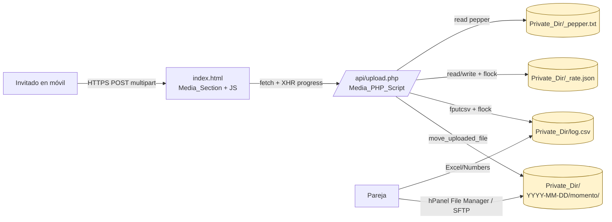
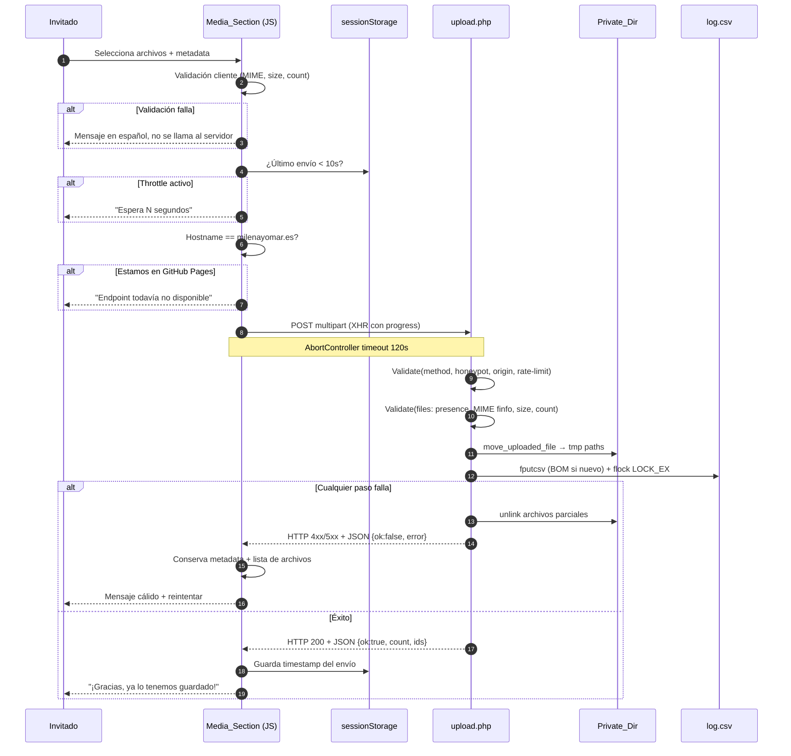

# Design Document — Guest Media Upload

## Overview

Esta feature añade a la web de la boda Milena & Omar (`https://milenayomar.es`) una sección **Media_Section** donde los invitados pueden subir fotos y vídeos durante la celebración, junto con tres metadatos opcionales (`personas`, `momento`, `pie`). El destino es **privado**: una carpeta fuera del web root en el alojamiento Hostinger Single de la pareja, más una fila por envío en `<Private_Dir>/log.csv`.

A diferencia del RSVP existente (que usa el truco de un `<iframe>` para hablar con Google Apps Script desde GitHub Pages), esta feature asume **same-origin**: cuando la web esté servida desde Hostinger, frontend (`index.html`) y endpoint (`/api/upload.php`) comparten origen `https://milenayomar.es`. Eso permite usar `fetch` + `XMLHttpRequest` con barra de progreso real y respuesta JSON, sin iframe.

Decisiones clave (todas derivadas de los 16 requirements):

- **Same-origin, sin terceros**: los archivos no van a Google Drive ni a un bucket S3. Quedan en `Private_Dir` en el plan Hostinger Single (50 GB SSD, PHP 8.x). Esto evita CORS, evita coste y mantiene el principio de "lo ven solo Milena y Omar".
- **CSV en vez de Sheets**: los metadatos viven en `<Private_Dir>/log.csv` (UTF-8 con BOM). La pareja lo abre con Excel/Numbers, sin segundo servicio que mantener.
- **El RSVP no se toca**: `apps-script/Code.gs` sigue como está (Requirement 14.1).
- **Una sola fuente de verdad de configuración**: el objeto `MEDIA_CONFIG` se declara dos veces (JS en `index.html` y PHP en `api/upload.php`). El servidor es la autoridad final si hay desfase (Requirement 13).
- **Defensa en profundidad sobre privacidad**: `Private_Dir` está fuera de `public_html`, sin endpoint de listado, sin URLs públicas, con `Options -Indexes` en `api/`, deshabilitando ejecución de PHP en `Private_Dir` y cabeceras de seguridad estándar.
- **Anti-abuso ligero**: honeypot + `sessionStorage` throttle + rate-limit por IP-hash y global en `_rate.json`. Sin captcha, sin login.
- **Feature flag y guard de hostname**: `MEDIA_FEATURE_ENABLED` permite ocultar la sección con un solo cambio. Mientras la web siga en GitHub Pages, un guard de `window.location.hostname` evita lanzar peticiones al endpoint inexistente (Requirement 15.6).

Resultado para el invitado: abre la web en el móvil, elige fotos/vídeos del carrete o saca una nueva, ve una barra de progreso, recibe un mensaje cálido en español. Resultado para la pareja: una carpeta organizada por fecha y momento, y un CSV con todo el contexto.

---

## Architecture

### High-level component map



Las cajas amarillas (`Private_Dir/...`) viven **fuera** de `public_html`. El servidor web nunca las sirve por URL. La única vía de lectura es la pareja vía hPanel o SFTP (Requirement 8.5).

### Upload flow (happy path + fallback)



### Repository ↔ deploy layout

```mermaid
graph TB
    subgraph Repo["Git repository (== public_html en deploy)"]
        R1[index.html]
        R2[assets/]
        R3[api/upload.php]
        R4[api/.htaccess]
        R5[tests/media.test.js]
        R6[tests/rsvp.test.js]
        R7[apps-script/Code.gs]
        R8[.gitignore]
        R9[README.md]
    end
    subgraph Hostinger["Hostinger Single — /home/<user>/"]
        H1[public_html/<br/>= contenido del repo]
        H2[private_uploads/<br/>= Private_Dir<br/>FUERA del web root]
        H2a[private_uploads/_pepper.txt]
        H2b[private_uploads/log.csv]
        H2c[private_uploads/_rate.json]
        H2d[private_uploads/.htaccess<br/>deny PHP exec]
        H2e[private_uploads/YYYY-MM-DD/momento/...]
    end
    Repo -->|deploy: git o FTP| H1
    H1 -->|llamadas POST| R3
    H2 -.creado a mano una vez.-> H2a
    H2 -.creado a mano una vez.-> H2b
    H2 -.creado a mano una vez.-> H2c
    H2 -.creado a mano una vez.-> H2d
    H2 -.creado por upload.php.-> H2e

    classDef repo fill:#e7f1ff,stroke:#1f4e8c
    classDef priv fill:#fff3cd,stroke:#856404
    class R1,R2,R3,R4,R5,R6,R7,R8,R9 repo
    class H2,H2a,H2b,H2c,H2d,H2e priv
```

`tests/`, `.kiro/`, `qa_shots/`, `node_modules/` quedan fuera del paquete que se despliega (Requirement 15.3).

---

## Components and Interfaces

### 1. Frontend — `index.html` Media_Section module

#### 1.1 HTML structure (located between `<!-- RSVP -->` and `<!-- NOSOTROS -->`)

Marcadores HTML obligatorios (Requirement 14.3):

```html
<!-- MEDIA -->
<section id="media" class="vichy" hidden>
  <p class="section-label reveal">02 — Recuerdos</p>
  <h2 class="section-title reveal">Compártenos <em>los momentos</em></h2>
  <p class="confirm-text reveal">
    Cuelguen aquí sus fotos y vídeos. Nos llegan directos a Milena y Omar; no
    se publican en ninguna galería pública.
  </p>

  <form id="media-form"
        action="/api/upload.php"
        method="POST"
        enctype="multipart/form-data"
        novalidate>
    <!-- Honeypot (oculto) -->
    <input type="text" name="bot-field" tabindex="-1" autocomplete="off"
           aria-hidden="true" style="position:absolute;left:-9999px;">

    <!-- Selector de archivos: cubre carrete y captura nativa -->
    <label class="form-label" for="media-files">Fotos y vídeos</label>
    <input id="media-files" name="archivos[]" type="file"
           accept="image/jpeg,image/png,image/webp,image/heic,image/heif,video/mp4,video/quicktime"
           multiple capture="environment">

    <ul id="media-file-list" aria-live="polite"></ul>

    <label class="form-label" for="media-personas">¿Quién sale?</label>
    <input id="media-personas" name="personas" type="text" maxlength="200"
           placeholder="P. ej. Marta y los primos">

    <label class="form-label" for="media-momento">¿En qué momento?</label>
    <select id="media-momento" name="momento">
      <option value="">Sin especificar</option>
      <option value="ceremonia">Ceremonia</option>
      <option value="coctel">Cóctel</option>
      <option value="cena">Cena</option>
      <option value="baile">Baile</option>
      <option value="otro">Otro</option>
    </select>

    <label class="form-label" for="media-pie">Pie de foto</label>
    <textarea id="media-pie" name="pie" maxlength="500" rows="3"
              placeholder="Una palabra, una broma, una dedicatoria..."></textarea>

    <progress id="media-progress" value="0" max="100" hidden></progress>
    <p id="media-status" role="status" aria-live="polite"></p>

    <button type="submit" class="btn-submit" id="media-submit">Enviar</button>
  </form>
</section>
<!-- /MEDIA -->
```

Notas:

- `hidden` en `<section>` se controla por JS leyendo `MEDIA_FEATURE_ENABLED` y el guard de hostname.
- `name="archivos[]"` para que PHP construya `$_FILES['archivos']` como array (multiples).
- `capture="environment"` activa cámara trasera en móvil; en desktop el navegador lo ignora.
- Botones e inputs cumplen `min-height: 44px` vía CSS (Requirement 1.4).
- Microcopy evita tecnicismos (Requirement 12.3): "fotos y vídeos", no "MIME"; "MB" en mensajes de error.

#### 1.2 `MEDIA_CONFIG` — fuente única de verdad en cliente

Declarado **una sola vez** en `index.html` cerca del resto del JS, comentado:

```js
// Configuración compartida con api/upload.php — cambiar AMBOS sitios.
const MEDIA_CONFIG = {
  ENABLED: true,                    // MEDIA_FEATURE_ENABLED — interruptor maestro
  ENDPOINT: '/api/upload.php',
  PROD_HOSTNAME: 'milenayomar.es',
  MAX_FILE_SIZE_BYTES: 30 * 1024 * 1024,        // 30 MB por archivo
  MAX_FILES_PER_SUBMISSION: 5,
  MAX_POST_SIZE_BYTES: 200 * 1024 * 1024,       // 200 MB total
  ALLOWED_MIME: [
    'image/jpeg','image/png','image/webp',
    'image/heic','image/heif',
    'video/mp4','video/quicktime',
  ],
  ALLOWED_EXT: ['.jpg','.jpeg','.png','.webp','.heic','.heif','.mp4','.mov'],
  MOMENT_OPTIONS: ['ceremonia','coctel','cena','baile','otro'],
  CLIENT_THROTTLE_MS: 10_000,        // 10 s entre envíos por pestaña
  REQUEST_TIMEOUT_MS: 120_000,       // AbortController 120 s
  STORAGE_KEY_LAST_SUBMIT: 'media:lastSubmitTs',
};
```

#### 1.3 Frontend module — pseudocódigo de las funciones puras

Las funciones que hagan algo no trivial se exponen como funciones nombradas para poder testarlas con `node --test` cargando el HTML y extrayendo el bloque, o reimplementándolas en el test (Requirement 14.2).

```js
function isFeatureEnabledHere() {
  if (!MEDIA_CONFIG.ENABLED) return false;
  // Mientras estemos en GitHub Pages el endpoint no existe.
  if (window.location.hostname !== MEDIA_CONFIG.PROD_HOSTNAME &&
      window.location.hostname !== 'localhost' &&
      window.location.hostname !== '127.0.0.1') {
    return false;
  }
  return true;
}

function classifyFile(file) {
  // Devuelve { ok: true } o { ok: false, reason: 'tipo'|'tamaño' }
  const extOk = MEDIA_CONFIG.ALLOWED_EXT.some(e =>
    file.name.toLowerCase().endsWith(e));
  const mimeOk = MEDIA_CONFIG.ALLOWED_MIME.includes(file.type);
  if (!extOk && !mimeOk) return { ok: false, reason: 'tipo' };
  if (file.size > MEDIA_CONFIG.MAX_FILE_SIZE_BYTES)
    return { ok: false, reason: 'tamano' };
  return { ok: true };
}

function validateSubmission(files) {
  if (files.length === 0) return { ok: false, msg: 'Selecciona al menos un archivo.' };
  if (files.length > MEDIA_CONFIG.MAX_FILES_PER_SUBMISSION)
    return { ok: false, msg: `Máximo ${MEDIA_CONFIG.MAX_FILES_PER_SUBMISSION} archivos por envío.` };
  let total = 0;
  for (const f of files) {
    const r = classifyFile(f);
    if (!r.ok) return { ok: false, msg: messageFor(r.reason, f) };
    total += f.size;
  }
  if (total > MEDIA_CONFIG.MAX_POST_SIZE_BYTES)
    return { ok: false, msg: 'En total son demasiados megabytes; envíalos en dos veces.' };
  return { ok: true };
}

function checkClientThrottle(now = Date.now()) {
  const last = Number(sessionStorage.getItem(MEDIA_CONFIG.STORAGE_KEY_LAST_SUBMIT) || 0);
  const delta = now - last;
  if (delta < MEDIA_CONFIG.CLIENT_THROTTLE_MS) {
    return { ok: false, waitMs: MEDIA_CONFIG.CLIENT_THROTTLE_MS - delta };
  }
  return { ok: true };
}

async function submitWithProgress(formData, { onProgress, signal }) {
  // XHR para tener evento `progress` real (fetch no expone upload progress
  // de forma fiable en navegadores móviles).
  return new Promise((resolve, reject) => {
    const xhr = new XMLHttpRequest();
    xhr.open('POST', MEDIA_CONFIG.ENDPOINT);
    xhr.responseType = 'json';
    xhr.upload.onprogress = (e) => {
      if (e.lengthComputable) onProgress((e.loaded / e.total) * 100);
    };
    xhr.onload  = () => resolve({ status: xhr.status, body: xhr.response });
    xhr.onerror = () => reject(new Error('network'));
    xhr.ontimeout = () => reject(new Error('timeout'));
    signal?.addEventListener('abort', () => xhr.abort());
    xhr.send(formData);
  });
}
```

Flujo del listener de submit:

1. `event.preventDefault()` (Requirement 2.2).
2. `if (!isFeatureEnabledHere()) { mensaje informativo; return; }` (Requirement 15.6).
3. `validateSubmission` → si falla, mostrar `msg` y NO llamar al servidor (Requirement 2.6, 5.1–5.3).
4. `checkClientThrottle` → si falla, mostrar `waitMs` (Requirement 11.2–11.3).
5. Construir `FormData` con los `<input>` + `archivos[]`.
6. Deshabilitar botón e inputs (Requirement 2.7).
7. `AbortController` con `setTimeout(120_000)` (Requirement 10.1).
8. `submitWithProgress` → barra `<progress>` 0→100 (Requirement 2.4).
9. En éxito: mostrar mensaje cálido, guardar timestamp en sessionStorage, **limpiar** archivos y mantener el formulario operativo. En fallo: NO limpiar metadata ni archivos (Requirement 10.2), mostrar `body.error` si existe.
10. Reactivar botón siempre.

Fallback nativo (Requirement 2.3): si `XMLHttpRequest` o `FormData` no existen (caso teórico, navegadores muy viejos), no se hace `preventDefault()` y el `<form>` envía nativo a `/api/upload.php`. PHP detecta `Origin` ausente y lo trata como same-origin.

### 2. Backend — `api/upload.php` Media_PHP_Script

Estructura del fichero:

```php
<?php
declare(strict_types=1);

// 1. MEDIA_CONFIG — espejo del cliente.
const MEDIA_CONFIG = [
    'PRIVATE_DIR'              => '/home/<user>/private_uploads',
    'ALLOWED_ORIGINS'          => ['https://milenayomar.es'],
    'ALLOWED_MIME'             => [
        'image/jpeg','image/png','image/webp',
        'image/heic','image/heif',
        'video/mp4','video/quicktime',
    ],
    'ALLOWED_EXT_BY_MIME' => [
        'image/jpeg' => 'jpg', 'image/png'  => 'png',
        'image/webp' => 'webp','image/heic' => 'heic','image/heif' => 'heif',
        'video/mp4'  => 'mp4', 'video/quicktime' => 'mov',
    ],
    'MAX_FILE_SIZE_BYTES'      => 30 * 1024 * 1024,
    'MAX_FILES_PER_SUBMISSION' => 5,
    'MAX_POST_SIZE_BYTES'      => 200 * 1024 * 1024,
    'MOMENT_OPTIONS'           => ['ceremonia','coctel','cena','baile','otro'],
    'RATE_LIMIT' => [
        'PER_IP_PER_MIN'   => 5,
        'PER_IP_PER_HOUR'  => 40,
        'GLOBAL_PER_MIN'   => 15,
        'WINDOW_PURGE_SEC' => 3600,
    ],
    'CSV_HEADERS' => [
        'Timestamp','Personas','Momento','Pie',
        'NumArchivos','Archivos','TamanoTotalKB',
        'IPHash','UserAgentHash','Source','Estado','Notas',
    ],
];

// 2. Cabeceras siempre.
emit_security_headers();

// 3. Pipeline de validación (early return).
try {
    require_method_post();          // 405
    swallow_honeypot_silently();    // 200 falso si bot-field != ''
    require_allowed_origin();       // 403
    enforce_rate_limit();           // 429 + Retry-After

    $payload  = parse_post_payload();
    $files    = parse_uploaded_files();   // 400 si vacío
    foreach ($files as $f) {
        validate_mime_and_size($f);       // 400 / 413 — rechaza submission completa
    }

    [$savedRelPaths, $totalKB] = persist_files($payload, $files);
    append_csv_row(build_csv_row($payload, $savedRelPaths, $totalKB, 'aceptado', ''));

    json_response(200, ['ok' => true, 'count' => count($savedRelPaths)]);

} catch (HttpError $e) {
    rollback_partial_files();             // borra cualquier asset ya escrito
    json_response($e->status, ['ok' => false, 'error' => $e->message, 'code' => $e->code]);
}
```

#### 2.1 Helpers expuestos como funciones puras

| Helper | Firma | Responsabilidad |
|---|---|---|
| `slugify(string $s, int $max = 40): string` | string→slug | Quita tildes, baja a minúsculas, sustituye no-`[a-z0-9]` por `-`, colapsa `-+`, recorta a `$max`. Si vacío → `'anon'`. |
| `safe_filename(int $ts, string $rand6, string $slug, string $ext): string` | → string | Concatena `<ts>_<rand6>_<slug>.<ext>`. Asegura que `ext` ∈ `ALLOWED_EXT_BY_MIME`. |
| `detect_mime(string $tmpPath): string` | → MIME | `finfo_file(FILEINFO_MIME_TYPE)`. Nunca confía en `$_FILES[...]['type']`. |
| `truncate_field(string $s, int $max): string` | → string | Recorte seguro multibyte (`mb_substr`). Requirement 4.6. |
| `hash_with_pepper(string $value, string $pepper): string` | → 16 hex chars | `substr(hash('sha256', $value.$pepper), 0, 16)`. |
| `rate_limit_check_and_record(string $ipHash): array` | → `{ok, retryAfter}` | Lee `_rate.json` con `flock(LOCK_EX)`, purga >1 h, comprueba 3 ventanas, anota timestamp si pasa. |
| `build_csv_row(array $payload, array $relPaths, int $totalKB, string $estado, string $notas): array` | → fila | Función **pura** sin I/O — testeable directamente. Devuelve array en el orden de `CSV_HEADERS`. |
| `append_csv_row(array $row): void` | I/O | Abre `log.csv` con `LOCK_EX`. Si no existía, escribe BOM `\xEF\xBB\xBF` + cabecera. Después `fputcsv($fp, $row, ',', '"', '\\')`. |
| `persist_files(array $payload, array $files): array` | → `[relPaths, totalKB]` | Crea `<Private_Dir>/<YYYY-MM-DD>/<momento>/`, mueve cada `$_FILES[...]['tmp_name']` con `move_uploaded_file`, `chmod 0640`, dirs `0750`. Devuelve rutas relativas a `Private_Dir`. |
| `rollback_partial_files(): void` | I/O | Lee la lista in-memory de archivos ya movidos en esta request y `unlink` cada uno. NO toca el CSV. |

#### 2.2 Filename strategy (Requirement 6.3)

```
<unix_ts>_<rand6>_<slug-personas>.<ext>
```

- `unix_ts` = `time()`.
- `rand6`   = `bin2hex(random_bytes(3))` — 6 hex chars criptográficamente seguros.
- `slug-personas` = `slugify($payload['personas'], 40)`; vacío → `'anon'`.
- `ext` = `MEDIA_CONFIG['ALLOWED_EXT_BY_MIME'][detect_mime(tmp)]`. NUNCA del nombre cliente (Requirement 6.3.4, 7.4).

Garantía: el nombre solo contiene `[0-9a-z_\-\.]`. No hay `..`, ni `/`, ni `\`, ni NUL, ni espacios (Requirement 7.6).

#### 2.3 Directory layout (Requirement 6.2)

```
<Private_Dir>/
├── _pepper.txt                     (manual, fuera de Git)
├── _rate.json                      (creado por upload.php)
├── .htaccess                       (php_flag engine off)
├── log.csv                         (creado por upload.php, BOM la 1ª vez)
└── 2027-04-09/
    ├── ceremonia/
    │   └── 1712680000_a3f8b2_marta.jpg
    ├── coctel/
    ├── cena/
    ├── baile/
    └── otro/
```

`<momento>` es un valor de `MOMENT_OPTIONS`; si el cliente envía vacío o algo fuera de la lista → `'otro'`.

#### 2.4 `api/.htaccess` (sirve a `public_html/api/`)

```apache
Options -Indexes
<FilesMatch "^(?!upload\.php$).*\.php$">
    Require all denied
</FilesMatch>
```

Y en `Private_Dir/.htaccess` (defensa en profundidad — Requirement 7.7):

```apache
php_flag engine off
<FilesMatch "\.(php|phtml|phar|cgi|pl|py)$">
    Require all denied
</FilesMatch>
Options -Indexes
```

#### 2.5 Cabeceras de seguridad (Requirement 9)

`emit_security_headers()` añade en TODA respuesta:

- `Content-Type: application/json; charset=utf-8`
- `X-Content-Type-Options: nosniff`
- `X-Frame-Options: DENY`
- `Referrer-Policy: same-origin`
- `Strict-Transport-Security: max-age=31536000; includeSubDomains`
- **No** envía `Access-Control-Allow-Origin: *` (same-origin estricto).

`require_allowed_origin()`:

- Si `Origin` está presente → debe estar en `ALLOWED_ORIGINS`. En otro caso → 403.
- Si `Origin` está ausente → se acepta (envío nativo same-origin sin JS — Requirement 2.3).

### 3. Config schema — vista combinada

| Clave | Cliente (`MEDIA_CONFIG` JS) | Servidor (`MEDIA_CONFIG` PHP) | Notas |
|---|---|---|---|
| `ENABLED` | bool | — | Solo cliente. |
| `PROD_HOSTNAME` | `'milenayomar.es'` | — | Guard de hostname. |
| `ENDPOINT` | `'/api/upload.php'` | implícito | — |
| `MAX_FILE_SIZE_BYTES` | 30 MB | 30 MB | Servidor manda (Requirement 13.3). |
| `MAX_FILES_PER_SUBMISSION` | 5 | 5 | — |
| `MAX_POST_SIZE_BYTES` | 200 MB | 200 MB | Coordinado con `post_max_size` PHP. |
| `ALLOWED_MIME[]` | sí | sí | Detección real con `finfo` solo en server. |
| `ALLOWED_EXT[]` | sí | mapa MIME→ext | Cliente solo necesita la lista, servidor necesita el mapping para nombrar. |
| `MOMENT_OPTIONS[]` | `['ceremonia','coctel','cena','baile','otro']` | igual | Sin tildes en valor (URL/CSV-safe); el `<option>` muestra "Cóctel". |
| `CLIENT_THROTTLE_MS` | 10 000 | — | Solo cliente. |
| `REQUEST_TIMEOUT_MS` | 120 000 | — | Solo cliente; server usa `max_execution_time` PHP. |
| `RATE_LIMIT.*` | — | sí | Solo servidor. |
| `CSV_HEADERS[]` | — | sí | Documentación. |

### 4. PHP runtime configuration (hPanel — Requirement 13.4 / 15.4)

Valores recomendados a fijar manualmente en hPanel → Avanzado → Configuración PHP:

| Directiva | Valor |
|---|---|
| `upload_max_filesize` | `30M` |
| `post_max_size`       | `200M` |
| `max_file_uploads`    | `≥ 5` |
| `max_execution_time`  | `120` |
| `memory_limit`        | `256M` |

Si hPanel no permite `post_max_size > upload_max_filesize × max_file_uploads`, ajustar `upload_max_filesize` hacia abajo y replicar el cambio en `MEDIA_CONFIG.MAX_FILE_SIZE_BYTES` (cliente y server).

---

## Data Models

### Submission (lógica, en memoria)

Representa **un POST** del formulario.

| Campo | Tipo | Origen | Validación | Notas |
|---|---|---|---|---|
| `timestamp` | int (Unix s) | `time()` server | — | Mismo valor para todos los assets de la submission. |
| `personas` | string | `$_POST['personas']` | trim, `mb_substr ≤ 200` | Opcional (Requirement 4.4). |
| `momento` | enum | `$_POST['momento']` | ∈ `MOMENT_OPTIONS` ∪ `''` | Vacío → `'otro'` para path. |
| `pie` | string | `$_POST['pie']` | trim, `mb_substr ≤ 500` | Opcional. |
| `archivos[]` | Asset[] | `$_FILES['archivos']` | 1 ≤ count ≤ 5 | — |
| `bot_field` | string | `$_POST['bot-field']` | debe ser vacío | Si != '' → 200 falso silencioso. |
| `ip` | string | `$_SERVER['REMOTE_ADDR']` | — | Solo se hashea, nunca se loga en claro. |
| `user_agent` | string | `$_SERVER['HTTP_USER_AGENT']` | — | Idem. |
| `origin` | string\|null | `$_SERVER['HTTP_ORIGIN']` | ∈ `ALLOWED_ORIGINS` ∪ ausente | — |

### Asset (cada archivo individual)

| Campo | Tipo | Origen | Validación | Notas |
|---|---|---|---|---|
| `tmp_name` | string | `$_FILES[i]['tmp_name']` | `is_uploaded_file()` | Ruta local de PHP. |
| `original_name` | string | `$_FILES[i]['name']` | — | Solo para diagnosticar, nunca para nombrar el destino. |
| `size_bytes` | int | `filesize(tmp_name)` | ≤ `MAX_FILE_SIZE_BYTES` | Medido en server, no del cliente. |
| `mime_detected` | string | `finfo_file(...)` | ∈ `ALLOWED_MIME` | Autoridad final. |
| `final_name` | string | `safe_filename(...)` | regex `^[0-9]+_[0-9a-f]{6}_[a-z0-9-]{1,40}\.(jpg|jpeg|png|webp|heic|heif|mp4|mov)$` | Tras escribir. |
| `rel_path` | string | `<YYYY-MM-DD>/<momento>/<final_name>` | empieza por fecha ISO, no contiene `..` | Lo que va al CSV. |

### CSV row schema — `<Private_Dir>/log.csv`

Cabecera (UTF-8 con BOM la primera vez — Requirement 6.4, 6.9):

```
Timestamp,Personas,Momento,Pie,NumArchivos,Archivos,TamanoTotalKB,IPHash,UserAgentHash,Source,Estado,Notas
```

| Columna | Tipo | Ejemplo | Reglas |
|---|---|---|---|
| `Timestamp`     | ISO 8601 UTC | `2027-04-09T22:13:20Z` | `gmdate('c', $timestamp)`. |
| `Personas`      | string | `Marta y los primos` | Truncado a 200 caracteres mb-safe. |
| `Momento`       | enum | `coctel` | Uno de `MOMENT_OPTIONS` o `''`. |
| `Pie`           | string | `Antes del baile` | Truncado a 500. |
| `NumArchivos`   | int | `3` | `count(rel_paths)`. |
| `Archivos`      | string | `2027-04-09/coctel/171...jpg;2027-04-09/coctel/171...mp4` | Separador `;`, NUNCA URLs públicas (Requirement 6.5). |
| `TamanoTotalKB` | int | `4823` | `intval(round(sum(size_bytes)/1024))`. |
| `IPHash`        | 16 hex chars | `9f8c1a2b3d4e5f60` | `hash_with_pepper($ip, $pepper)`. |
| `UserAgentHash` | 16 hex chars | `aa11bb22cc33dd44` | Idem para UA. |
| `Source`        | string | `web` | Constante `'web'` en esta versión. |
| `Estado`        | enum | `pendiente` \| `aceptado` \| `rechazado` | Inicial: `aceptado` cuando todo sale bien; `rechazado` cuando un envío supera la validación HTTP pero la pareja debería revisarlo (futuro). El RSVP usa `pendiente`; aquí `pendiente` se reserva para revisión manual de la pareja. **Decisión**: para la primera versión escribimos siempre `pendiente` (igual que el RSVP, Requirement 6.8); el campo `Notas` recoge motivos de rechazo en envíos no fatales (Requirement 13.3). |
| `Notas`         | string | `''` o `MIME mismatch` | Vacío en éxito. |

Quoting: usamos `fputcsv` estándar de PHP (`,`, `"`, `\`). Cualquier `,`, `"`, `\n` en `Personas` o `Pie` queda escapado correctamente. El separador interno de `Archivos` es `;` para no chocar con el separador CSV.

### `_rate.json` schema

```json
{
  "global": [1712680000, 1712680005, 1712680042],
  "byIp": {
    "9f8c1a2b3d4e5f60": [1712680000, 1712680005],
    "aa11bb22cc33dd44": [1712680042]
  },
  "purgedAt": 1712680042
}
```

- `global`: array de timestamps (segundos) de los **últimos** envíos aceptados, recortado a los de la última hora.
- `byIp`: `IPHash` → array de timestamps en la última hora.
- `purgedAt`: marca para no purgar más de 1 vez por minuto.

Política (Requirement 11.4):

- Por `IPHash`: ≤ 5 en los últimos 60 s **y** ≤ 40 en los últimos 3 600 s.
- Global: ≤ 15 en los últimos 60 s.
- Si supera cualquiera → 429 + `Retry-After: <segundos hasta liberar la ventana más restrictiva>`.

Acceso concurrente: `fopen` + `flock(LOCK_EX)` + `ftruncate` + `fwrite` + `flock(LOCK_UN)`. Sin libs externas.

### `_pepper.txt`

Contenido: una sola línea con un secreto aleatorio (≥ 32 bytes hex). Generado a mano la primera vez:

```bash
php -r 'echo bin2hex(random_bytes(32));' > /home/<user>/private_uploads/_pepper.txt
chmod 600 /home/<user>/private_uploads/_pepper.txt
```

NUNCA versionado (`.gitignore`, Requirement 16.3). Leído al inicio de cada request con `file_get_contents` y `trim`.

---

## Correctness Properties

*A property is a characteristic or behavior that should hold true across all valid executions of a system — essentially, a formal statement about what the system should do. Properties serve as the bridge between human-readable specifications and machine-verifiable correctness guarantees.*

PBT aplica claramente a esta feature: hay funciones puras (`slugify`, `safe_filename`, `truncate_field`, `hash_with_pepper`, `build_csv_row`, `classifyFile`, `validateSubmission`, `checkClientThrottle`, `rate_limit_check_and_record`) y un conjunto de invariantes que deben mantenerse para cualquier `Submission` y cualquier secuencia de envíos. Los tests sobre PHP se ejecutan vía `child_process.spawnSync('php', ...)` y se marcan como `skipped` si `php` no está en el PATH (Requirement 14.5).

Cada propiedad referencia los acceptance criteria originales que valida.

### Property 1: Client-side validation never contacts the server

*For any* `Submission` cuya selección de archivos viole alguna de las reglas del cliente (selección vacía, número de archivos > `MAX_FILES_PER_SUBMISSION`, algún archivo con MIME ∉ `ALLOWED_MIME` y extensión ∉ `ALLOWED_EXT`, algún archivo con tamaño > `MAX_FILE_SIZE_BYTES`, o suma de tamaños > `MAX_POST_SIZE_BYTES`), `validateSubmission(files)` retorna `{ ok: false }` y el handler de submit **no** dispara ninguna petición HTTP.

**Validates: Requirements 2.6, 3.5, 5.1, 5.2, 5.3**

### Property 2: Server responses are always JSON without leaks

*For any* petición recibida por `api/upload.php` (válida, malformada, no autorizada, rate-limited, o errónea por causas internas), la respuesta tiene `Content-Type: application/json; charset=utf-8` y su cuerpo es JSON parseable que **no** contiene la subcadena `Stack trace`, ni rutas absolutas del filesystem (`/home/`, `C:\`), ni texto generado por avisos/errores de PHP.

**Validates: Requirements 2.8, 7.9**

### Property 3: Server rejects out-of-policy submissions and is the final authority

*For any* `Submission` recibida por el servidor en la que al menos un `Asset` tiene MIME (detectado por `finfo`) ∉ `ALLOWED_MIME`, o tamaño (medido por `filesize`) > `MAX_FILE_SIZE_BYTES`, o el total de archivos > `MAX_FILES_PER_SUBMISSION`, o no hay ningún archivo, el servidor responde con un código de error (400 o 413), independientemente de lo que haya aceptado el cliente. La configuración del servidor es la autoridad final.

**Validates: Requirements 5.1, 5.2, 5.3, 7.3, 7.4, 7.5, 13.3**

### Property 4: Submission atomicity on failure

*For any* `Submission` que falle en cualquier paso del pipeline (validación, `move_uploaded_file`, escritura del CSV, o cualquier excepción), tras el manejo del error: (a) no queda **ningún** `Asset` de esa `Submission` en `Private_Dir`, y (b) el número de filas de `log.csv` es exactamente igual al que había antes de la petición.

**Validates: Requirements 6.10, 7.4, 7.5**

### Property 5: Persisted asset path is well-formed and traversal-free

*For any* `Submission` aceptada con metadatos arbitrarios (incluidos `personas` con tildes, ñ, comillas, espacios, control chars, caracteres NUL, secuencias `..`, `/`, `\`, o cadena vacía) y cualquier `Asset` con MIME válido, la ruta relativa persistida en `Private_Dir` matchea la expresión regular:

```
^[0-9]{4}-[0-9]{2}-[0-9]{2}/(ceremonia|coctel|cena|baile|otro)/[0-9]+_[0-9a-f]{6}_[a-z0-9-]{1,40}\.(jpg|jpeg|png|webp|heic|heif|mp4|mov)$
```

Y por construcción no contiene `..`, `/` (más allá de los separadores de directorio), `\`, NUL, espacios, ni caracteres de control.

**Validates: Requirements 6.2, 6.3, 7.6**

### Property 6: CSV `Archivos` column tracks exactly NumArchivos relative entries

*For any* `Submission` aceptada con N archivos (1 ≤ N ≤ `MAX_FILES_PER_SUBMISSION`), la fila escrita en `log.csv` cumple: `NumArchivos == N`, `Archivos.split(';').length == N`, y ninguno de los N elementos empieza por `http://` o `https://` ni contiene espacios. Cada elemento matchea la regex de la Property 5.

**Validates: Requirements 6.5**

### Property 7: Hashes are 16 hex chars and depend on the pepper

*For any* string de entrada `s` (IP, User-Agent, o cualquier otra) y cualquier par de peppers distintos `p1 != p2`: `hash_with_pepper(s, p1)` matchea `^[0-9a-f]{16}$`, y `hash_with_pepper(s, p1) != hash_with_pepper(s, p2)`.

**Validates: Requirements 6.6, 6.7**

### Property 8: CSV row round-trip preserves user metadata

*For any* `Submission` con `personas`, `momento`, `pie`, `Source` arbitrarios (incluidos casos con tildes, ñ, comillas dobles, comas, saltos de línea, punto y coma), si `row = build_csv_row(payload)` y `parsed = parse_csv_row(serialize_csv(row))` (parseo simétrico estándar de CSV), entonces `parsed.Personas == truncate(payload.personas, 200)`, `parsed.Pie == truncate(payload.pie, 500)`, `parsed.Momento == normalize_momento(payload.momento)`, y `parsed.Source == payload.source`. Como corolario, ninguno de estos campos contiene mojibake (`Ã`, `Â`, `â`, `ð`).

**Validates: Requirements 14.4**

### Property 9: Field truncation is multibyte-safe and bounded

*For any* string UTF-8 `s` y cualquier `max ≥ 0`, `truncate_field(s, max)` cumple: `mb_strlen(result) ≤ max`, el resultado es UTF-8 válido (no introduce secuencias de bytes inválidas al cortar), y si `mb_strlen(s) ≤ max` entonces `result == s`.

**Validates: Requirements 4.6**

### Property 10: Non-POST methods are rejected with 405

*For any* método HTTP `M ∈ {GET, PUT, DELETE, PATCH, OPTIONS, HEAD}` enviado a `api/upload.php`, la respuesta tiene status `405` y cabecera `Allow: POST`, sin tocar `Private_Dir` ni `log.csv`.

**Validates: Requirements 7.1, 8.4**

### Property 11: Honeypot non-empty produces silent acceptance with zero side effects

*For any* petición POST con `bot-field` cuyo valor (tras `trim`) no es vacío, la respuesta es `200` con body `{"ok": true, "status": "received"}`, y el estado del servidor permanece inmutable: ningún archivo añadido a `Private_Dir`, ninguna fila añadida a `log.csv`, y `_rate.json` no contabiliza el envío.

**Validates: Requirements 7.2**

### Property 12: File and directory permissions match the privacy policy

*For any* `Asset` persistido por `persist_files`, `fileperms($path) & 0777 == 0640`. Para cualquier directorio creado por `persist_files` (`<YYYY-MM-DD>` o `<momento>`), `fileperms($dir) & 0777 == 0750`.

**Validates: Requirements 7.8**

### Property 13: All security headers present in every response

*For any* respuesta del endpoint (cualquier código HTTP, cualquier rama del pipeline), el conjunto de cabeceras incluye: `X-Content-Type-Options: nosniff`, `X-Frame-Options: DENY`, `Referrer-Policy: same-origin`, `Strict-Transport-Security: max-age=31536000; includeSubDomains`. La cabecera `Access-Control-Allow-Origin` nunca tiene valor `*`.

**Validates: Requirements 9.1, 9.3**

### Property 14: Origin is restricted to milenayomar.es or absent

*For any* petición cuyo header `Origin` esté presente y no sea `https://milenayomar.es`, la respuesta tiene status `403` y no se procesan ni archivos ni metadatos. Si `Origin` está ausente, la petición se considera same-origin nativa y procede.

**Validates: Requirements 9.2**

### Property 15: Form state is preserved on any failure and server messages surface

*For any* envío fallido (timeout local, error de red, status 4xx, status 5xx), tras el manejo del error: el valor de cada `<input>`/`<textarea>` y la lista de archivos seleccionados son **idénticos** a los que había justo antes del clic de envío. Adicionalmente, si la respuesta fue un JSON con campo `error`, el texto mostrado al invitado coincide con `body.error`.

**Validates: Requirements 10.2, 10.3**

### Property 16: Client throttle blocks resubmits within 10 s

*For any* par de timestamps `(t1, t2)` con `t2 ≥ t1`, donde `t1` es el último envío exitoso registrado en `sessionStorage` bajo `MEDIA_CONFIG.STORAGE_KEY_LAST_SUBMIT`, `checkClientThrottle(t2)` devuelve `{ ok: false, waitMs: > 0 }` si y solo si `t2 - t1 < MEDIA_CONFIG.CLIENT_THROTTLE_MS` (10 000 ms).

**Validates: Requirements 11.2, 11.3**

### Property 17: Server rate limits enforce the stated thresholds

*For any* secuencia de timestamps `T = [t_1 ≤ t_2 ≤ ... ≤ t_n]` correspondiente a peticiones del mismo `IPHash`, `rate_limit_check_and_record` rechaza la petición `t_n` con status `429` y cabecera `Retry-After: r` (entero positivo en segundos) si y solo si se cumple alguna de:

- `|{ t_i ∈ T : t_n - t_i < 60 ∧ same IPHash }| > 5`,
- `|{ t_i ∈ T : t_n - t_i < 3600 ∧ same IPHash }| > 40`,
- `|{ t_i ∈ T : t_n - t_i < 60 ∧ any IPHash }| > 15`.

Cuando se acepta, el timestamp `t_n` se añade a `_rate.json` antes del retorno.

**Validates: Requirements 11.4, 11.5**

### Property 18: `_rate.json` purges entries older than 1 hour

*For any* contenido inicial de `_rate.json` con timestamps en `global` y en `byIp[*]` distribuidos en cualquier momento del pasado, tras una llamada a `rate_limit_check_and_record(now)`, el fichero resultante no contiene ningún timestamp `t` tal que `now - t > 3600`.

**Validates: Requirements 11.6**

### Property 19: No mojibake on the served HTML surface

*For any* lectura de `index.html` servida por el repo, el contenido HTML no contiene los caracteres `Ã`, `Â`, `â` ni `ð`. (Esta misma comprobación ya existe para el RSVP en `tests/rsvp.test.js` y se extiende a la `Media_Section`.)

**Validates: Requirements 12.4**

### Property 20: Hostname guard prevents XHR outside the production domain

*For any* `window.location.hostname` distinto de `milenayomar.es`, `localhost` o `127.0.0.1`, `isFeatureEnabledHere()` retorna `false` y el handler de submit no dispara ninguna petición HTTP, mostrando en su lugar el mensaje informativo definido por la pareja.

**Validates: Requirements 15.6**

### Property 21: Empty or unspecified momento is accepted and normalised to `'otro'`

*For any* `Submission` válida en lo demás cuyo campo `momento` sea cadena vacía o un valor fuera de `MOMENT_OPTIONS`, el servidor responde `200` y los archivos se persisten bajo `<Private_Dir>/<YYYY-MM-DD>/otro/`. Para cualquier `momento ∈ MOMENT_OPTIONS`, la persistencia ocurre bajo el subdirectorio homónimo.

**Validates: Requirements 4.5**

---


## Error Handling

### Categorías de error

| # | Capa | Disparador | Visible para el invitado | Visible para la pareja |
|---|---|---|---|---|
| E1 | Cliente | Validación local falla | Mensaje cálido en español, no se llama al server | — |
| E2 | Cliente | `AbortController` 120 s | "Tu envío está tardando, prueba de nuevo." | — |
| E3 | Cliente | `xhr.onerror` (red) | "Parece que se perdió la conexión, inténtalo otra vez." | — |
| E4 | Cliente | Hostname guard | "Estamos rematando esta sección. En unos días podrás subir aquí." | — |
| E5 | Server | Validación request | JSON `{ ok:false, error:"..." }` con status apropiado | (si corresponde) fila CSV con `Estado=rechazado` y `Notas=<motivo>` |
| E6 | Server | I/O (mover archivo, escribir CSV) | JSON 500 + mensaje genérico | Sin fila CSV (rollback) |
| E7 | Server | Rate-limit | JSON 429 + `Retry-After` | Sin fila CSV |
| E8 | Server | Honeypot | JSON 200 falso `{ok:true,status:"received"}` | Sin fila CSV |

### Tabla de status HTTP por requirement

| Requirement | Condición | Status | Headers extra | Body JSON |
|---|---|---|---|---|
| 7.1 / 8.4 | Método ∉ POST | `405` | `Allow: POST` | `{ok:false,error:"Método no permitido",code:"method"}` |
| 7.2 | `bot-field` no vacío | `200` | — | `{ok:true,status:"received"}` (silencioso) |
| 9.2 | `Origin` no permitido | `403` | — | `{ok:false,error:"Origen no permitido",code:"origin"}` |
| 11.4 | Rate-limit superado | `429` | `Retry-After: <s>` | `{ok:false,error:"Demasiados envíos, prueba en unos minutos",code:"rate"}` |
| 7.3 | Sin archivos en `$_FILES` | `400` | — | `{ok:false,error:"Selecciona al menos un archivo",code:"empty"}` |
| 5.1 / 7.4 | MIME (server) ∉ `ALLOWED_MIME` | `400` | — | `{ok:false,error:"Tipo de archivo no soportado",code:"mime"}` |
| 7.6 | Demasiados archivos (`> MAX_FILES_PER_SUBMISSION`) | `400` | — | `{ok:false,error:"Máximo 5 archivos por envío",code:"count"}` |
| 5.2 / 7.5 | Tamaño individual > `MAX_FILE_SIZE_BYTES` | `413` | — | `{ok:false,error:"Algún archivo supera 30 MB",code:"size"}` |
| 5.3 | Suma > `MAX_POST_SIZE_BYTES` (PHP rechaza antes) | `413` | — | `{ok:false,error:"En total son demasiados megabytes",code:"post"}` |
| 6.10 | I/O o CSV write falla | `500` | — | `{ok:false,error:"No pudimos guardar tu envío, inténtalo de nuevo",code:"io"}` |
| 9.x default | Cualquier respuesta | header set | `X-Content-Type-Options`, `X-Frame-Options`, `Referrer-Policy`, `Strict-Transport-Security` | — |

### Reglas transversales

1. **Atomicidad** (Property 4): cualquier fallo después de haber movido al menos un archivo dispara `rollback_partial_files()` antes de responder. El CSV se actualiza únicamente si todo el resto del pipeline tuvo éxito.
2. **No leak**: `error_reporting` queda implícito en producción (`display_errors=Off`); el catch global convierte cualquier `Throwable` no esperado en una respuesta `500` con mensaje genérico (`"Algo no fue bien por nuestro lado"`). El stack trace se manda a `error_log` del servidor, nunca al cliente (Property 2 / Requirement 7.9).
3. **Mensajes**: las cadenas visibles al invitado están en español, sin acrónimos (Requirement 12.3); los `code` son tokens cortos para diagnóstico interno y no se traducen.
4. **Reintentos**: el cliente preserva metadata + lista de archivos (Property 15) y reactiva el botón. El invitado puede reintentar sin retecla.

---

## Testing Strategy

### Visión general

Se mantiene el corredor existente (`node --test`, sin dependencias externas, sin step de build) por consistencia con `tests/rsvp.test.js` (Requirement 14.1). Se añade `tests/media.test.js` con dos bloques: (1) aserciones estructurales rápidas sobre `index.html` y `api/upload.php`, y (2) propiedades sobre las funciones puras del cliente reimplementadas/cargadas en el test, más propiedades sobre PHP ejecutadas vía `child_process.spawnSync('php', ...)` y skippeadas si `php` no está en el PATH (Requirement 14.5).

### Librería de PBT

JavaScript: **`fast-check`** (`devDependencies`, único package nuevo). Es la elección estándar de PBT en Node sin requerir build. Configuración por test: 100 iteraciones (`numRuns: 100`), seed estable.

PHP: no se introduce un PBT framework PHP. En su lugar, los tests JS generan los inputs aleatorios con `fast-check`, los pasan a `php -r '<script>'` por argumentos o stdin, y verifican el resultado en JS. Esto evita añadir composer/PHPUnit al proyecto.

### Tagging convention

Cada test que valida una propiedad incluye un comentario:

```
// Feature: guest-media-upload, Property N: <texto resumido de la propiedad>
```

### Test plan

#### Bloque A — Estructura del HTML servido (EXAMPLE)

Tests rápidos, sin PBT, espejo del estilo de `rsvp.test.js`:

- A.1 — `<!-- RSVP -->` aparece antes de `<!-- MEDIA -->`, que aparece antes de `<!-- NOSOTROS -->` (Requirement 1.2, 14.3).
- A.2 — `<form id="media-form" action="/api/upload.php" method="POST" enctype="multipart/form-data"` presente.
- A.3 — Honeypot `<input type="text" name="bot-field" tabindex="-1"` con `aria-hidden="true"`.
- A.4 — `<input ... type="file" name="archivos[]" ... multiple ... capture="environment"` con `accept` cubriendo todos los `Allowed_MIME_Types`.
- A.5 — Campos `personas`, `momento`, `pie` con sus `name` correctos. Los `<option>` de `momento` corresponden exactamente a `MOMENT_OPTIONS`.
- A.6 — Bloque `MEDIA_CONFIG = {` aparece exactamente una vez en `index.html` (Requirement 5.4 / 13.1).
- A.7 — `assert.doesNotMatch(html, /Ã|Â|â|ð/)` — Property 19 / Requirement 12.4.
- A.8 — Existencia de `api/upload.php` con: bloque `<?php`, `const MEDIA_CONFIG`, helpers `slugify`, `safe_filename`, `detect_mime`, `append_to_csv`/`append_csv_row`, comprobación de método POST, comprobación de honeypot (Requirement 14.2.5).
- A.9 — Existencia de `api/.htaccess` con `Options -Indexes`.
- A.10 — `.gitignore` contiene `_pepper.txt`, `private_uploads/`, `qa_shots/`, `node_modules/` (Requirement 16.3).
- A.11 — `README.md` contiene un apartado "Subida de medios (Hostinger)" con los puntos enumerados en el Requirement 16.

#### Bloque B — Propiedades sobre el cliente (PBT en JS)

Las funciones puras (`classifyFile`, `validateSubmission`, `checkClientThrottle`, `slugify_js`, `isFeatureEnabledHere`) se reimplementan en el test como **espejo puro** del JS de `index.html`, o se cargan extrayendo el bloque `MEDIA_CONFIG` y las funciones por marcadores `// --- pure-functions-begin ---` / `// --- pure-functions-end ---` definidos en `index.html`. Esto evita arrancar un navegador.

- B.1 — Property 1 (validación cliente nunca contacta al server):
  ```js
  fc.assert(fc.property(arbInvalidFileSelection(), (files) => {
    const xhrSpy = installXhrSpy();
    handleSubmit({ files, ...arbValidMetadata.sample()[0] });
    return xhrSpy.callCount === 0;
  }), { numRuns: 100 });
  ```
- B.2 — Property 16 (client throttle): `fc.integer({min:0,max:30000})` para Δ; `checkClientThrottle(last+Δ).ok === (Δ ≥ 10000)`.
- B.3 — Property 20 (hostname guard): `fc.string()` para hostname; aceptar solo `milenayomar.es`/`localhost`/`127.0.0.1`.
- B.4 — Property 15 (form state preservado): para cada tipo de error simulado en XHR (red/timeout/4xx/5xx), snapshot de inputs antes y después coincide.

#### Bloque C — `build_csv_row` round-trip (PBT en JS, mirror puro de PHP)

`build_csv_row` se mantiene como función pura en PHP, pero se proporciona un **espejo JS** en `tests/media.test.js` (función `build_csv_row_js`) implementado a partir del mismo contrato. El test:

- C.1 — Property 8: para `personas`, `pie` ∈ `fc.fullUnicodeString({maxLength: 1000})` y `momento` ∈ `fc.constantFrom(...MOMENT_OPTIONS, '', 'algo-invalido')`, serializar la fila con `csv-stringify` mínimo y parsearla con un parser CSV mínimo (ambos implementados en el propio test, sin dependencia externa). Las columnas `Personas`, `Pie`, `Momento`, `Source` round-trippean (modulo truncado y normalización de momento).
- C.2 — Property 9 (truncate): `mb_strlen(truncate(s, max)) ≤ max` para `s` arbitrario y `max ∈ {0, 200, 500}`.

#### Bloque D — Propiedades sobre PHP (PBT cruzado JS↔PHP, skippeable)

Skip si `spawnSync('php', ['-v']).status !== 0` (Requirement 14.5). El harness:

```js
function runPhp(scriptName, jsonInput) {
  const r = spawnSync('php', ['-r', readScript(scriptName)], { input: JSON.stringify(jsonInput), encoding: 'utf8' });
  return JSON.parse(r.stdout);
}
```

Cada `scriptName` es un wrapper PHP en `tests/php_helpers/` que:

1. `require 'api/upload.php';` con un guard `if (!defined('MEDIA_TEST_MODE'))` para que el include no ejecute el flujo HTTP, sino que solo cargue las funciones puras.
2. Lee JSON de stdin, llama a la función bajo test, vuelca JSON a stdout.

Tests cubiertos:

- D.1 — Property 5 + Property 7 (filename + hashes): generar `personas` con `fc.fullUnicodeString()` (incl. `..`, `/`, `\0`, control chars, vacío); `safe_filename(ts, rand6, slugify(personas), ext)` matchea la regex acordada. `hash_with_pepper(s, p)` matchea `^[0-9a-f]{16}$` y `hash_with_pepper(s, p1) !== hash_with_pepper(s, p2)`.
- D.2 — Property 9 (truncate PHP-side): mismo input que C.2 vía PHP, mismo invariante.
- D.3 — Property 8 (round-trip PHP-side): comparar `build_csv_row` JS y `build_csv_row` PHP sobre el mismo input — deben producir filas idénticas.
- D.4 — Property 17 + 18 (rate-limit + purge): generar secuencias de timestamps y `IPHash` con `fast-check`, ejecutar `rate_limit_check_and_record` repetidamente sobre un `_rate.json` temporal en un directorio efímero (`fs.mkdtempSync`); verificar las 3 desigualdades y que ningún timestamp `> 3600 s` permanece.
- D.5 — Property 11 (honeypot): para `bot-field ∈ fc.string({minLength: 1})`, `handle_request_for_test()` retorna `{status:200, body:{ok:true,status:'received'}, files_persisted:0, csv_lines_added:0}`.

#### Bloque E — Smoke / integración mínima

- E.1 — Permisos (Property 12): después de `persist_files` sobre un directorio temporal, `fileperms($file) & 0777 === 0640` y `fileperms($dir) & 0777 === 0750`. Skippeable en Windows si los permisos POSIX no se aplican.
- E.2 — BOM (Requirement 6.9): si `log.csv` no existe, `append_csv_row` lo crea con bytes iniciales `0xEF 0xBB 0xBF`.
- E.3 — Cabeceras (Property 13): script PHP que invoca el handler real con un mock minimal de `$_SERVER` y captura `headers_list()`; el set debe incluir las 4 cabeceras de seguridad.

### Mantenimiento de los tests existentes

- `tests/rsvp.test.js` permanece sin cambios funcionales (Requirement 14.1).
- El nuevo `tests/media.test.js` no comparte estado ni helpers globales con el RSVP.
- Si la pareja desactiva la feature poniendo `MEDIA_CONFIG.ENABLED = false`, los tests de presencia siguen pasando (la sección sigue en el HTML, solo `hidden`); los tests de hostname guard siguen pasando (la lógica sigue allí).

### Cobertura por requirement (resumen)

| Requirement | Tests |
|---|---|
| 1.x | A.1, A.2, A.7 |
| 2.x | A.2, B.1, D.5 (200 silencioso es 200 en JSON) |
| 3.x | A.4, B.1 (count) |
| 4.x | A.5, C.2, D.2 |
| 5.x | A.6, B.1, D.3 |
| 6.x | A.8, C.1, D.1, D.3, E.2 |
| 7.x | A.8, A.9, D.1, D.4 (rate ≠ honeypot pero comparten harness), D.5, E.3 |
| 8.x | A.8, A.9, A.10, E.1 |
| 9.x | E.3 |
| 10.x | B.4 |
| 11.x | A.3, B.2, D.4, D.5 |
| 12.x | A.7, C.1 |
| 13.x | A.6, A.8, A.11 |
| 14.x | el conjunto entero |
| 15.x | A.10, A.11, B.3 |
| 16.x | A.10, A.11 |

---
